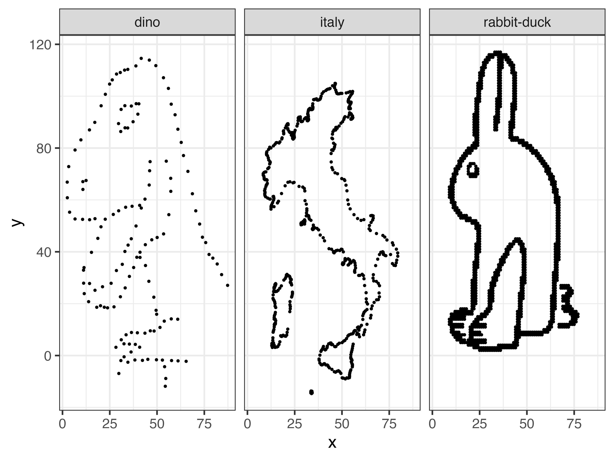

# Sammelsurium

*Sammelsurium* {noun} smorgasbord [figurative] [diverse collection of things]

# Homebrew

Install [homebrew](https://brew.sh/) with

        /bin/bash -c "$(curl -fsSL https://raw.githubusercontent.com/Homebrew/install/HEAD/install.sh)"

        grep -v '^#' Homebrew.txt | xargs brew install

Additional nice to have things that require extra taps:

        # Manage R installatino with rig for improved version control
        brew tap r-lib/rig
        brew install --cask rig
        rig install

# R installation

        Rscript R_install-packages.R

## R_rabbit-duck

Data as dataframe for the infamous rabbit-duck illusion in scatter plots with some additional dataset of equal mean, variance, and correlation:

|dataset     |x           |y           | Pearson correlation|
|:-----------|:-----------|:-----------|-------------------:|
|dino        |38.2 ± 18.7 |47.3 ± 35.2 |          -0.1037933|
|italy       |38.2 ± 18.7 |47.3 ± 35.2 |          -0.1037933|
|rabbit-duck |38.2 ± 18.7 |47.3 ± 35.2 |          -0.1037933|

        ❯ head R_rabbit-duck/fun-data.tsv
        x	y	dataset
        25	2	rabbit-duck
        26	2	rabbit-duck
        27	2	rabbit-duck
        ...

# R_slides.Rmd

Template for making slides in R, based on a template by [Claus Ekstrøm](https://publichealth.ku.dk/staff/?pure=en/persons/114029).

# Python installation (python_conda.yml)

List of packages that I like to use in a python:

        mamba env create --file python_conda.yml
        mamba activate pie
        python3
        ...

# LaTeX_report.tex

As the name suggest a simple template for LaTeX based reports.

# Feedbro-subscriptions

[Feedro](https://nodetics.com/feedbro/) RSS reader subscription list of 
various Biotech/Microbiology journals.

# Other 

The workflow manager [Snakemake](https://snakemake.readthedocs.io/en/stable/) is
fairly frequently used, so I like to have it in the base mamba environment:

        mamba install -c bioconda -n base snakemake

Copy `vimrc` and `zshrc` as dot-files to `$HOME` and install dependencies, as
listed in the files.
